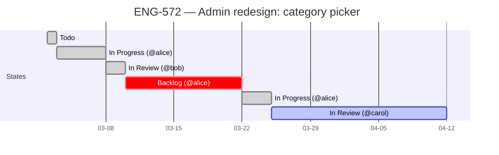
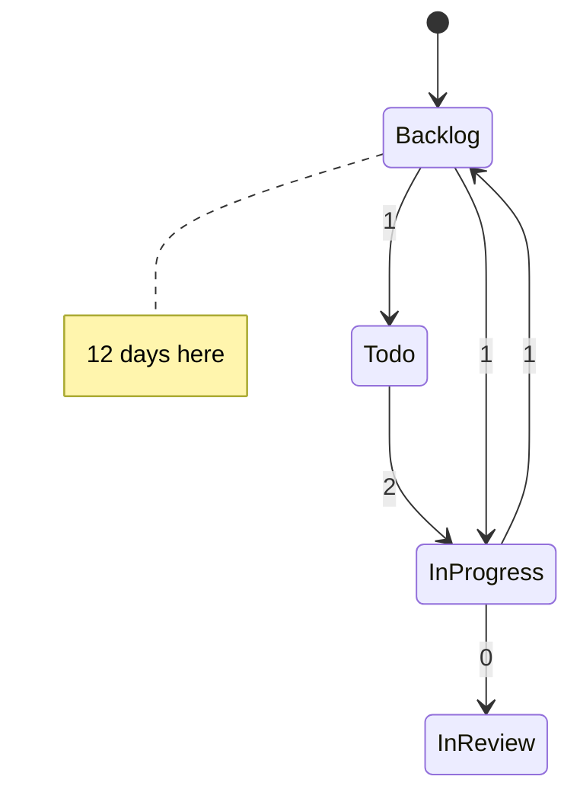

# Mermaid templates

Ready-to-fill skeletons for the diagrams produced by `flow_diagnostic`, `roadmap`, and `deep_dive` modes. Mermaid renders in GitHub, GitLab, Notion, Confluence (with plugin), Linear (in some views), and most chat UIs. If a host can't render Mermaid, paste the code into <https://mermaid.live> as a fallback.

---

## Sankey — state-flow across a cycle

The Sankey diagram (a.k.a. the "pipe-width" diagram you see in network traffic dashboards) shows transitions between states. Width = number of transitions. Backward transitions are first-class — render them as their own links so regressions are visible.

```mermaid
sankey-beta

%% source, target, value
Backlog,Todo,12
Todo,In Progress,12
In Progress,In Review,7
In Progress,Backlog,5
Backlog,In Progress,3
In Review,In Progress,2
In Review,Done,5
```

Rules:

- One row per `from,to,count` triple.
- Always include backward transitions (`In Progress → Backlog`, `In Review → In Progress`) as separate rows. Do not merge them into a single bidirectional edge.
- Drop rows where `count = 0`.
- Sort rows by source state's typical position in the forward flow, then by count desc — keeps the diagram readable.

If the team's flow uses non-standard state names (e.g., `Awaiting Release` instead of `Done`), use the literal names from the data (`list_issue_statuses`), not the canonical ones.

---

## Gantt — per-item timeline

Used in `flow_diagnostic` (for stuck items only) and `deep_dive` (for the focal item).



Rules:

- One row per state the issue has occupied. Include the **actor** in the row label so the timeline doubles as an audit log.
- Use status tags meaningfully:
  - `done` for completed (Done) states
  - `active` for the current state
  - `crit` for the longest single state span (visually highlights the bottleneck)
- `dateFormat YYYY-MM-DD` and `axisFormat %m-%d` are the defaults — don't change unless the user asks.
- If the item bounced (e.g., went back to `In Progress` after `In Review`), render the second `In Progress` as a separate row, not a continuation. The repetition is the point.

---

## Optional: stateDiagram for `deep_dive` summary view

If the deep-dive item has a complex history (>10 transitions), summarize with a state diagram showing transition counts:



Use this only when the gantt becomes unreadable from sheer length. Default to the gantt.
